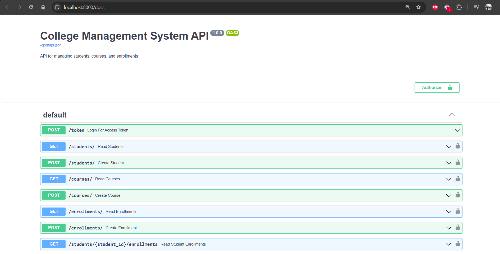
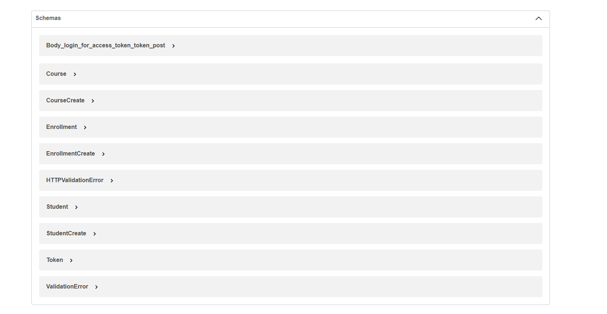
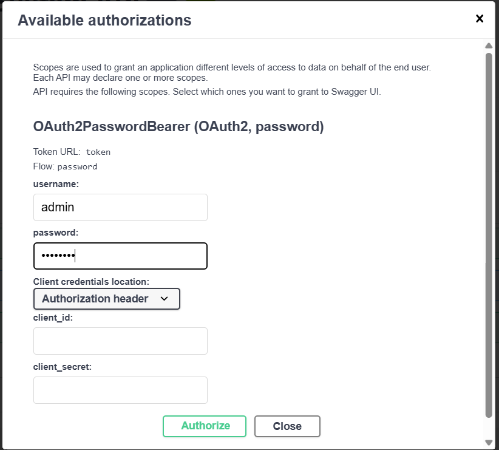
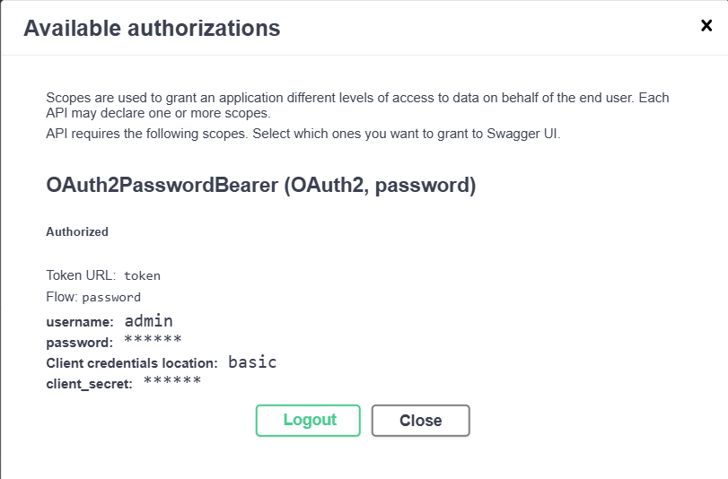
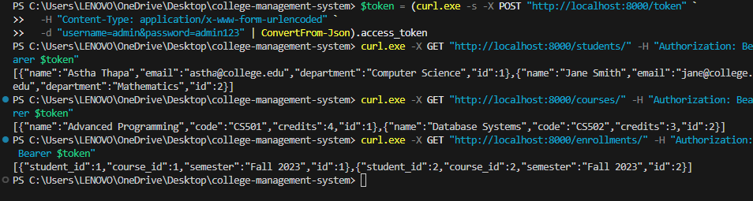

# Title: College Management System  
---  
> **Name:** Astha Thapa  
> **Roll no:** 221707  
> **Department:** BE Software Engineering  
> **Semester:** Sixth (6th)  
> **Elective Subject:** Web Services  

<p align="right"><sub><sup>Checkout below for output images.</sup></sub></p>

## Introduction

This project is a **College Management System** backend API built with **FastAPI**. It provides RESTful endpoints to manage students, courses, and enrollments with secure JWT-based authentication. The project uses **PostgreSQL** as the database, managed with SQLAlchemy ORM. The entire backend and database are containerized with **Docker** and orchestrated using **docker-compose**.

## Objectives

- Develop a secure and scalable REST API to manage college data.  
- Implement JWT authentication with password hashing.  
- Use SQLAlchemy for ORM and PostgreSQL for persistence.  
- Containerize the backend and database for easy deployment.  
- Provide API documentation via FastAPI's built-in Swagger UI.  
- Include pgAdmin container for database inspection.
 
## How to Run the Project

### Prerequisites

- Docker and Docker Compose installed on your machine.

### Steps

1. Clone the repository:
   ```bash
   git clone https://github.com/asthathapaa/college-management-system.git
   cd college-management-system

2. Accessing Services API Documentation:
   ```bash
   `http://localhost:8000/docs`

3. pgAdmin Interface:
   ```bash  
   `http://localhost:5050`

4. Default pgAdmin Credentials
**Email:** `admin@admin.com`  
**Password:** `admin`  

5. Authentication
   1. Get JWT Token from `/token` endpoint using:
      - **Username:** `admin`
      - **Password:** `admin123`

   2. Use the token to access protected endpoints:
      - `/students/`
      - `/courses/`
      - `/enrollment/`


6. Docker Deployment

   ```bash
   docker-compose up -d --build
   docker-compose exec web python seed.py

## Expected Output

- Interactive API documentation with accessible endpoints
- JWT authentication providing access tokens
- Full CRUD functionality for:
  - Students management
  - Courses management
  - Enrollments management
- pgAdmin GUI showing complete database schemas and tables

## Resulting Images







## Tech Stack
- **Backend Framework:** FastAPI (Python)  
- **Database:** PostgreSQL  
- **ORM:** SQLAlchemy  
- **Authentication:** JWT  
- **Containerization:** Docker + Docker Compose  
- **API Documentation:** Swagger UI  

## Frontend Status

 **Work In Progress (WIP)**  
- React frontend not included in current submission
- Current focus: Backend API and Docker containerization
- Frontend development timeline: Post backend evaluation

## Conclusion

**Project Deliverables:**
- Robust backend solution for college data management
- Secure JWT authentication system
- Containerized deployment using Docker
- Easy setup and testing environment
- Comprehensive database management via pgAdmin
- Well-documented API for seamless integration

## Author
Astha Thapa
